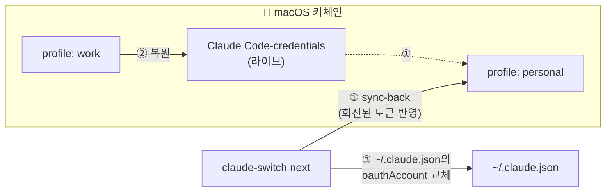

<div align="center">

# 🔄 claude-switch

**Claude Code 토큰 리밋이 찼다면? 명령 하나로 다음 구독 계정으로 전환하세요.**

[](https://github.com/YangTaeyoung/claude-switch/actions/workflows/ci.yml)
[](https://github.com/YangTaeyoung/claude-switch/releases/latest)
[](https://go.dev/)
[](https://www.apple.com/macos/)
[](LICENSE)

[English](README.md) · [한국어](README.ko.md)

</div>

---

```console
$ claude-switch next
Switched to profile "personal" (personal@example.com)
Takes effect for new claude sessions. Restart any running session.

$ claude-switch status
Active profile: personal

  work      work@example.com      limit: allowed | 5h 80% (resets 06-12 16:00) | 7d 12% (resets 06-19 14:00)
* personal  personal@example.com  limit: allowed | 5h 3%  (resets 06-12 18:00) | 7d 40% (resets 06-15 09:00)
```

## ✨ 주요 기능

- **⚡ 명령 하나로 전환** — `claude-switch next` 한 번이면 다음 등록 계정으로 순환. 셸 래퍼도, 환경변수도, 재로그인도 필요 없습니다.
- **📊 계정별 사용량 한눈에** — `status`가 Anthropic의 `anthropic-ratelimit-unified-*` 헤더에서 읽어온 **실제 5시간/7일 사용률과 리셋 시각**을 계정별로 보여줍니다. 어느 계정에 여유가 있는지 전환 *전에* 알 수 있습니다.
- **🔐 키체인 네이티브, 평문 저장 없음** — 자격증명은 디스크에 닿지 않습니다. 프로필은 Claude Code 자체 방식과 동일하게 macOS 키체인 항목으로 저장됩니다.
- **🔁 토큰 회전 대응** — Claude Code는 사용 중 refresh token을 회전시킵니다. claude-switch는 전환 직전 살아있는 자격증명을 활성 프로필에 *sync-back* 하므로, 지난주에 저장한 프로필도 오늘 그대로 동작합니다.
- **🪶 의존성 제로** — 순수 Go 표준 라이브러리. 작은 바이너리 하나.

## 📦 설치

[최신 릴리즈](https://github.com/YangTaeyoung/claude-switch/releases/latest)에서 **빌드된 바이너리**(macOS 유니버설, arm64 + x86_64)를 받거나:

```shell
go install github.com/YangTaeyoung/claude-switch@latest
```

소스에서 빌드:

```shell
git clone https://github.com/YangTaeyoung/claude-switch.git
cd claude-switch && go build -o claude-switch .
```

## 🚀 빠른 시작

**1. 계정마다 한 번씩 등록** — Claude Code로 로그인한 뒤 스냅샷:

```shell
claude              # A계정으로 /login 후 종료
claude-switch save work

claude              # B계정으로 /login 후 종료
claude-switch save personal
```

**2. 리밋이 차면:**

```shell
claude-switch next
```

끝. 새로 시작하는 `claude` 세션부터 다음 계정이 적용됩니다.

### 전체 명령

| 명령 | 동작 |
|---|---|
| `claude-switch save <name>` | 현재 로그인된 계정을 프로필로 저장 |
| `claude-switch use <name>` | 지정 프로필로 전환 |
| `claude-switch next` | 다음 프로필로 순환 전환 |
| `claude-switch list` | 프로필 목록 (`*` = 활성) |
| `claude-switch status` | 계정별 사용량(5h/7d)과 리셋 시각 |
| `claude-switch delete <name>` | 프로필 삭제 (활성 프로필은 보호) |

## ⚙️ 동작 원리

macOS에서 Claude Code는 OAuth 자격증명을 키체인 항목 `Claude Code-credentials`에 저장합니다 ([공식 문서](https://code.claude.com/docs/en/authentication)). claude-switch는 이 항목을 프로필 단위로 교체합니다:



1. **Sync-back** — 살아있는(회전됐을 수 있는) 자격증명을 현재 활성 프로필에 먼저 반영
2. **복원** — 대상 프로필의 자격증명을 라이브 `Claude Code-credentials` 항목에 기록
3. **계정 정보 교체** — `~/.claude.json`의 `oauthAccount`를 교체해 `/status`에 올바른 계정이 표시되게 함

`~/.config/claude-switch/config.json`에는 비밀값이 아닌 메타데이터(프로필명, 순서, 이메일)만 저장됩니다.

## ⚠️ 한계

- **macOS 전용.** Linux/Windows는 자격증명을 `.credentials.json`에 저장하므로 (아직) 지원하지 않습니다.
- **실행 중인 세션은 기존 계정 유지** — 전환은 새 `claude` 세션부터 적용됩니다.
- **`status`는 프로필당 최소 inference 요청 1회를 보냅니다** (haiku 1토큰) — 무과금 엔드포인트는 리밋 헤더를 반환하지 않는 것을 실측으로 확인했습니다. 비용은 극미하지만 0은 아닙니다.
- 첫 키체인 접근 시 macOS 허용 프롬프트가 뜰 수 있습니다 — "항상 허용"을 선택하세요.

## 📄 라이선스

[MIT](LICENSE)

---

<div align="center">
<sub>Go로 제작 · Anthropic과 무관한 개인 프로젝트</sub>
</div>
