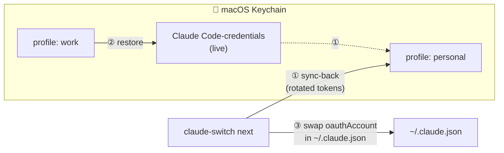

<div align="center">

# 🔄 claude-switch

**Hit your Claude Code usage limit? Switch to your next subscription account with one command.**

[](https://github.com/YangTaeyoung/claude-switch/actions/workflows/ci.yml)
[](https://go.dev/)
[](https://www.apple.com/macos/)
[](LICENSE)

[English](README.md) · [한국어](README.ko.md)

</div>

---

```console
$ claude-switch next
Switched to profile "personal" (personal@example.com)
Takes effect for new claude sessions. Restart any running session.

$ claude-switch status
Active profile: personal

  work      work@example.com      limit: allowed | 5h 80% (resets 06-12 16:00) | 7d 12% (resets 06-19 14:00)
* personal  personal@example.com  limit: allowed | 5h 3%  (resets 06-12 18:00) | 7d 40% (resets 06-15 09:00)
```

## ✨ Features

- **⚡ One-command switching** — `claude-switch next` cycles to your next registered account. No shell wrappers, no env vars, no re-login.
- **📊 Live usage visibility** — `status` shows each account's real 5-hour / 7-day utilization and reset times, straight from Anthropic's `anthropic-ratelimit-unified-*` headers. Know *before* you switch which account has headroom.
- **🔐 Keychain-native, zero plaintext** — credentials never touch disk. Profiles are stored as macOS Keychain items, exactly like Claude Code stores its own.
- **🔁 Token-rotation safe** — Claude Code rotates refresh tokens while you work. claude-switch *syncs back* the live credentials into the active profile before every switch, so a profile you saved last week still works today.
- **🪶 Zero dependencies** — pure Go standard library. One small binary.

## 📦 Installation

```shell
go install github.com/YangTaeyoung/claude-switch@latest
```

Or build from source:

```shell
git clone https://github.com/YangTaeyoung/claude-switch.git
cd claude-switch && go build -o claude-switch .
```

## 🚀 Quick Start

**1. Register each account once** — log in with Claude Code, then snapshot it:

```shell
claude              # /login with account A, then exit
claude-switch save work

claude              # /login with account B, then exit
claude-switch save personal
```

**2. When you hit the limit:**

```shell
claude-switch next
```

That's it. New `claude` sessions use the next account.

### All commands

| Command | What it does |
|---|---|
| `claude-switch save <name>` | Snapshot the currently logged-in account as a profile |
| `claude-switch use <name>` | Switch to a specific profile |
| `claude-switch next` | Cycle to the next profile |
| `claude-switch list` | List profiles (`*` = active) |
| `claude-switch status` | Per-account usage (5h/7d windows) and reset times |
| `claude-switch delete <name>` | Remove a profile (the active one is protected) |

## ⚙️ How it works

On macOS, Claude Code stores its OAuth credentials in the Keychain item `Claude Code-credentials` ([official docs](https://code.claude.com/docs/en/authentication)). claude-switch swaps that item per profile:



1. **Sync-back** — the live (possibly rotated) credentials are written back into the currently active profile
2. **Restore** — the target profile's credentials become the live `Claude Code-credentials` item
3. **Identity swap** — `oauthAccount` in `~/.claude.json` is replaced so `/status` shows the right account

Only non-secret metadata (profile names, order, emails) lives in `~/.config/claude-switch/config.json`.

## ⚠️ Limitations

- **macOS only.** Linux/Windows store credentials in `.credentials.json`; not supported (yet).
- **Running sessions keep their old account** until restarted — switching applies to new `claude` sessions.
- **`status` sends one minimal inference request per profile** (1 haiku token) — free endpoints don't return rate-limit headers (verified empirically). The cost is negligible but not zero.
- First Keychain access may trigger a macOS permission prompt — choose "Always Allow".

## 📄 License

[MIT](LICENSE)

---

<div align="center">
<sub>Built with Go · Not affiliated with Anthropic</sub>
</div>
